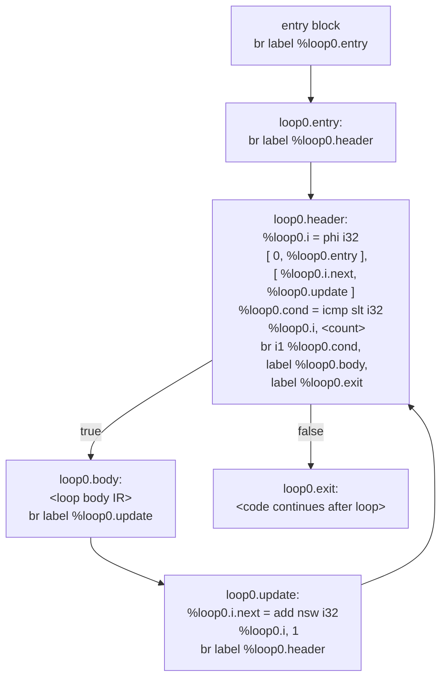

# LLVM IR Cheatsheet — Wenyan Compiler Assignment

All IR patterns you will actually need in this assignment, using the exact naming conventions and framework as the codebase. This is a reference — feel free to adapt and extend as you see fit.

Consult this when implementing IR-generation functions, or when you're unsure how to write a particular instruction.

Related documents: [Assignment Spec](114-2%20Compiler%20Homework%202.md)　[README](README.md)　[YACC Cheatsheet](YACC_CHEATSHEET.md)

---

## Core Concepts

### Virtual Registers vs. Memory Variables

LLVM IR has two ways to "hold a value":

| Approach | Syntax | Conceptual equivalent |
|----------|--------|-----------------------|
| Virtual register | `%reg0` | Intermediate computation value; can only be written once (SSA) |
| Memory address | `%var.0` (allocated by `alloca`) | Local variable; supports multiple `store`/`load` operations |

**Project naming conventions:**
- Computation registers: `%reg<registerCount>` (allocated by `object_createRegisterSymbol`)
- Local variables: `%var.<variableCount>` (allocated by `scope_addSymbol`)

### The `%%` Issue

`buffPrintln` calls `printf` internally, so every `%` in the format string must be written as `%%`:

```c
buffPrintln(&ctx->code, "%%var.%d = alloca i32", symbol->index);
// output: %var.0 = alloca i32
```

---

## Variable Declaration, Assignment, and Read

### alloca — Allocate local variable space

```llvm
%var.0 = alloca i32       ; integer
%var.1 = alloca i64       ; long integer
%var.2 = alloca double    ; floating point
%var.3 = alloca i1        ; boolean
%var.4 = alloca ptr       ; string or array (pointer)
```

```c
// Corresponding buffPrintln form:
buffPrintln(&ctx->code, "%%var.%d = alloca %s", symbol->index, llvmTypeName);
```

### store — Write a value

```llvm
store i32 42, ptr %var.0
store double 3.14, ptr %var.2
store i1 1, ptr %var.3       ; true = 1, false = 0
store ptr %reg5, ptr %var.4  ; store string/array pointer
```

```c
buffPrintln(&ctx->code, "store %s %s, ptr %%var.%d",
            llvmTypeName, regName, symbol->index);
```

### load — Read a value

```llvm
%reg0 = load i32, ptr %var.0
%reg1 = load double, ptr %var.2
```

The `SYMBOL` branch of `object_nameLiteralOrLoadReg` emits this instruction automatically; callers do not need to write it manually.

---

## Type Mapping

| ObjectType | LLVM type | `objectType2llvmType[]` |
|------------|-----------|------------------------|
| `OBJECT_TYPE_I32` | `i32` | `"i32"` |
| `OBJECT_TYPE_I64` | `i64` | `"i64"` |
| `OBJECT_TYPE_F64` | `double` | `"double"` |
| `OBJECT_TYPE_BOOL` | `i1` | `"i1"` |
| `OBJECT_TYPE_STR` | `ptr` | `"ptr"` |
| `OBJECT_TYPE_ARRAY` | `ptr` | `"ptr"` |

---

## Arithmetic Operations

### Integer (i32 / i64)

```llvm
%reg2 = add nsw i32 %reg0, %reg1    ; add
%reg2 = sub nsw i32 %reg0, %reg1    ; subtract
%reg2 = mul nsw i32 %reg0, %reg1    ; multiply
%reg2 = sdiv i32 %reg0, %reg1       ; divide (signed integer)
%reg2 = srem i32 %reg0, %reg1       ; remainder (mod)
```

`nsw` (No Signed Wrap) = undefined behavior on overflow; used for integer add/sub/mul.

### Floating-point (double)

```llvm
%reg2 = fadd double %reg0, %reg1
%reg2 = fsub double %reg0, %reg1
%reg2 = fmul double %reg0, %reg1
%reg2 = fdiv double %reg0, %reg1
```

### Project usage

`opIRIntNames[eop]` maps to the integer IR opcode; `opIRFloatNames[eop]` maps to the float opcode:

```c
const char* opType = ObjectType_isFloat(targetType)
    ? opIRFloatNames[eop]
    : opIRIntNames[eop];
buffPrintln(&ctx->code, "%%reg%s = %s %s %s, %s",
            resultReg.name, opType, llvmTypeName, cacheA, cacheB);
```

---

## Type Promotion

In this project, promotion is one-directional: I32 → I64 → F64. `object_loadRegAndPromote` emits the following IR automatically:

### sext — Sign-extend integer (i32 → i64)

```llvm
%reg1 = sext i32 %reg0 to i64
```

### sitofp — Integer to float (i32/i64 → double)

```llvm
%reg1 = sitofp i32 %reg0 to double
%reg1 = sitofp i64 %reg0 to double
```

Rarely need to write these manually — let `object_loadRegAndPromote` handle it.

---

## Comparison Operations

### icmp — Integer / pointer comparison

```llvm
%reg2 = icmp slt i32 %reg0, %reg1   ; signed less than (<)
%reg2 = icmp sgt i32 %reg0, %reg1   ; signed greater than (>)
%reg2 = icmp sle i32 %reg0, %reg1   ; signed less or equal (<=)
%reg2 = icmp sge i32 %reg0, %reg1   ; signed greater or equal (>=)
%reg2 = icmp eq  i32 %reg0, %reg1   ; equal (==)
%reg2 = icmp ne  i32 %reg0, %reg1   ; not equal (!=)
```

The result type is always `i1` (bool).

### fcmp — Floating-point comparison

```llvm
%reg2 = fcmp olt double %reg0, %reg1   ; ordered less than
%reg2 = fcmp ogt double %reg0, %reg1
%reg2 = fcmp ole double %reg0, %reg1
%reg2 = fcmp oge double %reg0, %reg1
%reg2 = fcmp oeq double %reg0, %reg1
%reg2 = fcmp one double %reg0, %reg1
```

`opIRIntNames` / `opIRFloatNames` already include the correct icmp/fcmp variants; retrieve them via `opIRIntNames[eop]`.

---

## Logic Operations (i1)

```llvm
%reg2 = and i1 %reg0, %reg1    ; &&
%reg2 = or  i1 %reg0, %reg1    ; ||
```

---

## Branches and Labels

### Unconditional branch

```llvm
br label %target
```

```c
buffPrintln(&ctx->code, "br label %%loop%d.body", scope->id);
```

### Conditional branch

```llvm
br i1 %cond, label %true_label, label %false_label
```

### Label definition

Label definition lines are **not indented** — use `buffPrintlnS`; all other instructions use `buffPrintln` (auto-indented):

```llvm
if0.true:           ← buffPrintlnS, no indent
    store i32 ...   ← buffPrintln, indented
```

> `buffPrintlnS` — "S" stands for Statement-level (no indent)

### `%%` escaping rules

`buffPrintln` calls `printf` internally; every `%` in the format string must be written as `%%` to produce a single `%` in the output:

| Desired IR | buffPrintln format string |
|------------|--------------------------|
| `%loop0.i` | `"%%loop%d.i"` |
| `%reg5` | `"%%reg%s"` |
| `%if0.true` | `"%%if%d.true"` |
| `%var.3` | `"%%var.%d"` |

---

## phi Nodes (SSA for Loops)

### Why phi is needed

LLVM IR uses SSA (Static Single Assignment) form: **every virtual register may be assigned exactly once**.

Problem: a for-loop counter needs to be updated after each iteration, but SSA forbids assigning the same register twice.

Solution: `phi` nodes — the register's value is chosen based on which basic block the control flow came from:

```llvm
%loop0.i = phi i32 [ 0, %loop0.entry ],          ; from entry = 0 (initial value)
                   [ %loop0.i.next, %loop0.update ] ; from update = last updated value
```

### Complete for-loop structure



### IR sequence for `code_forLoop`

Follow the flow diagram above and emit the following IR in TODO step order (using `buffPrintln` / `buffPrintlnS`):

| Step | IR emitted | Notes |
|------|-----------|-------|
| Enter from entry | `br label %loop<id>.entry` | Jump into the loop entry block |
| entry label | `loop<id>.entry:` | Use `buffPrintlnS`, no indent |
| Get count value | (no IR — call `object_loadRegAndPromote`) | Convert count Object to IR operand string |
| Branch to header | `br label %loop<id>.header` | |
| header label | `loop<id>.header:` | Use `buffPrintlnS` |
| **phi node** | `%loop<id>.i = phi <type> [ 0, %loop<id>.entry ], [ %loop<id>.i.next, %loop<id>.update ]` | SSA counter; both source block names must match actual labels |
| Compare | `%loop<id>.cond = icmp slt <type> %loop<id>.i, <count>` | `slt` = signed less than |
| Conditional branch | `br i1 %loop<id>.cond, label %loop<id>.body, label %loop<id>.exit` | |
| body label | `loop<id>.body:` | Use `buffPrintlnS`; loop body follows |

### IR sequence for `code_forLoopEnd`

| Step | IR emitted | Notes |
|------|-----------|-------|
| Branch to update | `br label %loop<id>.update` | Jump from body to counter update block |
| update label | `loop<id>.update:` | Use `buffPrintlnS` |
| Increment counter | `%loop<id>.i.next = add nsw <type> %loop<id>.i, 1` | `nsw` = no signed wrap |
| Branch to header | `br label %loop<id>.header` | Enter next iteration's condition check |
| exit label | `loop<id>.exit:` | Use `buffPrintlnS`; code after the loop continues here |

> `<id>` = `scope->id`; `<type>` = `objectType2llvmType[loop->symbol.type]`

---

## while Loop Structure

Much simpler than for — no phi node:

```
loop0.body:        ← loop body entry
  <body IR>
  br label %loop0.body   ← back to top

loop0.exit:        ← break jumps here
```

`code_whileLoopStart` and `code_whileLoopEnd` are fully provided; you only need to implement `code_break`.

`code_break`: find the nearest enclosing loop scope and emit an **unconditional branch** to that loop's exit label:

```llvm
br label %loop<id>.exit
```

Before implementing, read `scope_findNearestLoop()`'s return-value description and check the exit label naming in `code_whileLoopEnd` / `code_forLoopEnd` to confirm the names match before emitting.

---

## if / elseif / else Structure

### if only (no else)

```
          br i1 %cond, label %if0.true, label %if0.false
if0.true:
          <true body>
          br label %if0.false     ← code_ifEnd path when elseifCount==0
if0.false:
          <continues>
```

### if + else

```
          br i1 %cond, label %if0.true, label %if0.false
if0.true:
          <true body>
          br label %if0.endif
if0.false:
          <else body>
          br label %if0.endif
if0.endif:
          <continues>
```

### if + elseif + else (elseifCount = 1)

```
          br i1 %cond0, label %if0.true, label %if0.false
if0.true:
          <if body>
          br label %if0.endif
if0.false:                         ← emitted by code_elseIfLabel
          br i1 %cond1, label %if0.elseif0.true, label %if0.elseif0.false
if0.elseif0.true:
          <elseif body>
          br label %if0.endif
if0.elseif0.false:                 ← code_ifEnd path: hasElseif but no else
          br label %if0.endif
if0.endif:
          <continues>
```

### Label naming

| Label | When emitted |
|-------|-------------|
| `if<id>.true` | if condition is true |
| `if<id>.false` | if condition is false (= end point when no elseif) |
| `if<id>.elseif<n>.true` | n-th elseif is true (n starts at 0) |
| `if<id>.elseif<n>.false` | n-th elseif is false |
| `if<id>.endif` | merge point after all branches (required when else or elseif is present) |

---

## Output Functions

### printf — Formatted output (numbers, strings)

```llvm
call i32 (ptr, ...) @printf(ptr @fmt_i32_n, i32 %reg0)
call i32 (ptr, ...) @printf(ptr @fmt_i64_n, i64 %reg1)
call i32 (ptr, ...) @printf(ptr @fmt_double_n, double %reg2)
call i32 (ptr, ...) @printf(ptr @fmt_ptr_n, ptr %reg3)
```

Format string naming: `@fmt_<llvmType>[_n]` (`_n` means with newline)

| Global constant | Format | Type |
|----------------|--------|------|
| `@fmt_i32` / `@fmt_i32_n` | `%d` | I32 |
| `@fmt_i64` / `@fmt_i64_n` | `%lld` | I64 |
| `@fmt_double` / `@fmt_double_n` | `%g` | F64 |
| `@fmt_ptr` / `@fmt_ptr_n` | `%s` | STR |

```c
// buffPrintln form:
buffPrintln(&ctx->code,
    "call i32 (ptr, ...) @printf(ptr @fmt_%s%s, %s %s)",
    objectType2llvmType[srcValueType],
    newLine ? "_n" : "",
    objectType2llvmType[srcValueType],
    regName);
```

### fwrite — Raw byte output (booleans, spaces)

```llvm
call i64 @fwrite(ptr @space, i64 1, i64 1, ptr %g_stdout)
call i64 @fwrite(ptr %reg_ptr, i64 1, i64 %reg_len, ptr %g_stdout)
```

Boolean output uses `select` to pick `@str_true[_n]` / `@str_false[_n]`; the complete implementation is already provided in the BOOL case of `code_stdoutPrintObject` — refer to it directly.

### select — Conditional value selection (ternary)

```llvm
%reg1 = select i1 %cond, ptr @str_true_n, ptr @str_false_n
%reg2 = select i1 %cond, i64 6, i64 6    ; both lengths (UTF-8 byte length of Chinese chars)
```

---

## Runtime Functions

Declared by `writeOutputHeader`; call them directly in your implementation:

| Function | Purpose | Signature |
|----------|---------|-----------|
| `@wy_rt_str_concat` | String concatenation | `ptr (ptr, ptr)` |
| `@wy_rt_str_length` | String length (UTF-8 character count) | `i64 (ptr)` |
| `@wy_rt_array_new` | Create a new array | `ptr (i64)` |
| `@wy_rt_array_add_ptr` | Array push | `void (ptr, ptr)` |
| `@wy_rt_array_get_ptr` | Array index access | `ptr (ptr, i64)` |
| `@wy_rt_array_get_length` | Array length | `i64 (ptr)` |

```llvm
; String length
%reg0 = call i64 @wy_rt_str_length(ptr %reg_str)

; Array length
%reg0 = call i64 @wy_rt_array_get_length(ptr %reg_arr)

; String concat (OP_ADD + STR)
%reg2 = call ptr @wy_rt_str_concat(ptr %reg_a, ptr %reg_b)
```

---

## Memory Management Quick Reference (object_free rules)

This is the most bug-prone area:

| Situation | Free? |
|-----------|-------|
| `object_nameLiteralOrLoadReg` return, and `src->type == OBJECT_TYPE_SYMBOL` | **Yes** — free the return value (newly allocated REGISTER) |
| `object_nameLiteralOrLoadReg` return, `src->type` is a literal or REGISTER | **No** — it borrows `*src` |
| `object_loadRegAndPromote` return, type was promoted (`promoted.type != src->type`) | **Yes** — free promotedObj |
| `object_loadRegAndPromote`, no promotion | **No** — do not free |
| Function parameter `Object* src` passed into a semantic action | Caller (yacc action) owns the free; do not free inside the callee |

**Standard cleanup pattern:**

```c
char regName[MAX_NAME_LENGTH];
Object regSrc = object_nameLiteralOrLoadReg(src, regName, MAX_NAME_LENGTH);
if (regSrc.type == OBJECT_TYPE_UNDEFINED) goto FAILED;

// ... use regName ...

if (src->type == OBJECT_TYPE_SYMBOL) object_free(&regSrc);  // conditional free
object_free(src);                                            // always free src
return false;

FAILED:
if (src->type == OBJECT_TYPE_SYMBOL) object_free(&regSrc);
object_free(src);
return true;
```

---

## Complete IR Output Examples

### Variable declaration: `吾有一數。曰一。名之曰「甲」。`

```llvm
%var.0 = alloca i32
store i32 1, ptr %var.0
```

### Read and print: `書之` (I32)

```llvm
%reg0 = load i32, ptr %var.0
call i32 (ptr, ...) @printf(ptr @fmt_i32_n, i32 %reg0)
```

### Assignment: `今「甲」是矣`

```llvm
%reg1 = load i32, ptr %var.0   ; read RHS value
store i32 %reg1, ptr %var.0    ; write to target
```

### Addition: `加甲乙` (i32)

```llvm
%reg0 = load i32, ptr %var.0   ; load 甲
%reg1 = load i32, ptr %var.1   ; load 乙
%reg2 = add nsw i32 %reg0, %reg1
```

### for loop (3 iterations)

```llvm
br label %loop0.entry
loop0.entry:
    br label %loop0.header
loop0.header:
    %loop0.i = phi i32 [ 0, %loop0.entry ], [ %loop0.i.next, %loop0.update ]
    %loop0.cond = icmp slt i32 %loop0.i, 3
    br i1 %loop0.cond, label %loop0.body, label %loop0.exit
loop0.body:
    ; <loop body>
    br label %loop0.update
loop0.update:
    %loop0.i.next = add nsw i32 %loop0.i, 1
    br label %loop0.header
loop0.exit:
```

### if / else

```llvm
%reg0 = load i32, ptr %var.0
%reg1 = icmp sgt i32 %reg0, 0

br i1 %reg1, label %if0.true, label %if0.false
if0.true:
    ; <true body>
    br label %if0.endif
if0.false:
    ; <else body>
    br label %if0.endif
if0.endif:
```
